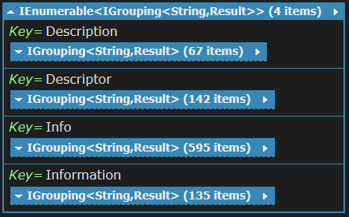

# Distribution of Information Endings in Public APIs

## Description

Main abstractions like e.g. `ISeed` will have corresponding classes that describe them. How to name those classes? Potential candidates are:

- <Abstraction>Info
- <Abstraction>Information
- <Abstraction>Description
- <Abstraction>Descriptor

Since they will be a part of the NSeed public API the choice of the name is very important. So we decided to see how such endings are used within existing public APIs.

## Running the Experiment

Open the linq file in [LINQPad](http://www.linqpad.net/) and run it.

## Results

Here is the screenshot of the result.

*Info* is the clear winner. Besides, all the reflection related APIs like e.g. `MemberInfo` prefere the *Info* ending. In our case, describing NSeed abstractions is a kind of reflection information.