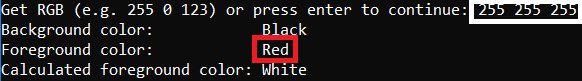
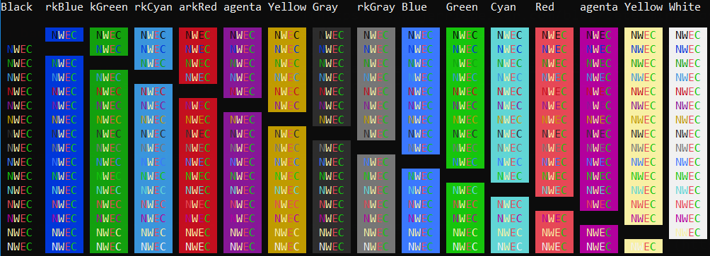
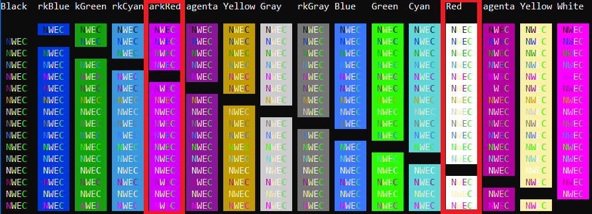

# Unobtrusive Console Colors

## Description

We want to have colored output on the console. For example, following typical conventions like using the red color for errors, yellow for warnings, and green for success.

However, assuming that these colors, typical for a Windows console, will always fit would be a false premise. Here are a few reasons for that:

- Mac has different standard console color scheme (Light) then Windows/Linux (Dark).
- PowerShell and CMD shell have different color schemes on Windows.
- Maybe a bit exaggerated, but I don't know two Linux users who have the same looking terminal ;-)
- Windows users change standard console colors too. I am one of them.

We want our colored output to be unobtrusive. Means, it should fit well to any color scheme that the user has.

Moreover, we want to respect the users who do not want to have any coloring. We will be [NO_COLOR](https://no-color.org/) compliant.

An additional challenge that we face is the fact that the [`ConsoleColor` enum](https://docs.microsoft.com/en-us/dotnet/api/system.consolecolor?view=netframework-4.8) supports only 16 colors.
How this works if the users have a color scheme different then the colors available in the `ConsoleColor` enum?

Thus, we have to investigate the following:

- How the console color defined by the user maps to `ConsoleColor` enum values?
- How to get good looking unobtrusive colors for our Tool and Engine CLI?

We want a simple and pragmatic solution that is easy to implement and works well in most of the cases. We ignore edge-cases.

A couple of interesting frameworks to look at:

- [Pastel](https://github.com/silkfire/Pastel)
- [Colorful.Console](https://github.com/tomakita/Colorful.Console)
- [Crayon](https://github.com/riezebosch/crayon)
- [Colorify](https://github.com/deinsoftware/colorify)
- [Edokan.KaiZen.Colors](https://github.com/edokan/Edokan.KaiZen.Colors)

Interesting articles to read:

- [NO_COLOR](https://no-color.org/)
- [Determine the ConsoleColor from a 24 bit hexadecimal color code](https://www.jerriepelser.com/blog/determine-consolecolor-from-hex-color/)
- [Determine font color based on background color](https://stackoverflow.com/questions/1855884/determine-font-color-based-on-background-color/1855903)
- [Using ANSI colour codes in .NET Core Console applications](https://www.jerriepelser.com/blog/using-ansi-color-codes-in-net-console-apps/)
- [Is it possible to write to the console in colour in .NET?](https://stackoverflow.com/questions/2743260/is-it-possible-to-write-to-the-console-in-colour-in-net)
- [24-bit Color in the Windows Console!](https://devblogs.microsoft.com/commandline/24-bit-color-in-the-windows-console/)

## Running the Experiment

The experiment exists of three projects. Each of them is self-explainable and can be run separately.

## Results

The mapping of a custom defined color to a `ConsoleColor` enum has some strange logic.
For example (255, 255, 255) is properly interpreted as `White` using the conversion algorithm described [here](https://www.jerriepelser.com/blog/determine-consolecolor-from-hex-color/) but is reported as `Red` as the `Console.ForegroundColor` property.

It would be interesting exercise to dig further and figure out why, but for the purpose of our implementation this can be ignored.

The decision:

- For the background color we always take `Console.BackgroundColor`.
- For the normal text color we always take `Console.ForegroundColor`.
- For warning, error, and confirmation colors we use the simple algorithm sketched in [GetUnobtrusiveColorScheme](GetUnobtrusiveColorScheme/Program.cs).
- When printig text we apply the foreground color for the printed line and call `Console.ResetColor()` afterwards.
- For standard warning, error, and confirmation colors we define two slightly different "themes", light for Mac and dark for Windows and Linux.

This simple approach gives quite good looking results in cases predefined colors are used.

The results are also find in the edge case when custom defined colors are used.

